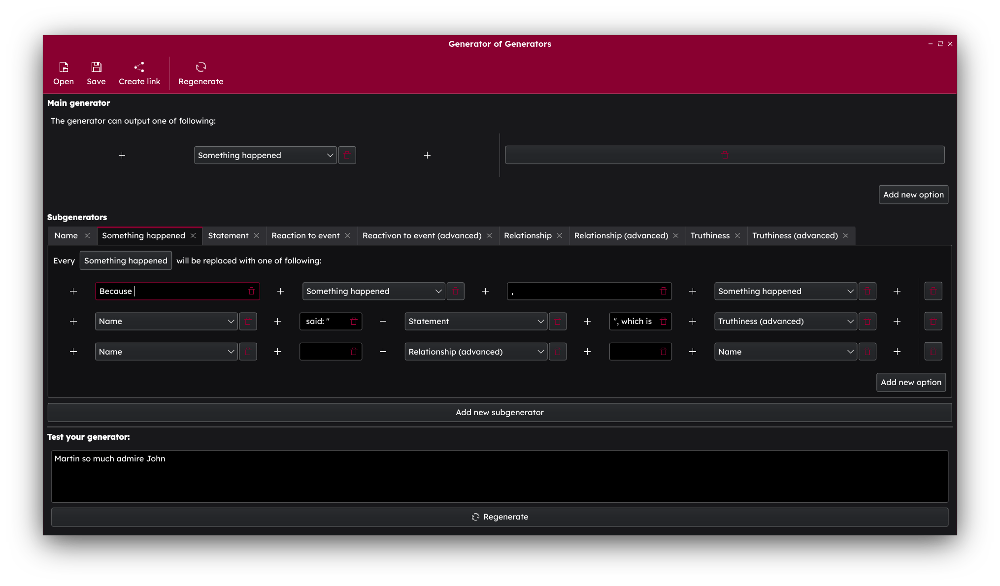

Generators of generators
========================

Create random text generators easilly without programming!

This app lets you create generators like this [generator of stories](https://generator-of-generators.vercel.app?generator=%7B%22main%22%3A%7B%22name%22%3A%22%22%2C%22opts%22%3A%5B%7B%22items%22%3A%5B%7B%22type%22%3A1%2C%22value%22%3A%22Something%20happened%22%7D%5D%7D%5D%7D%2C%22subgenerators%22%3A%5B%7B%22name%22%3A%22Name%22%2C%22opts%22%3A%5B%7B%22items%22%3A%5B%7B%22type%22%3A0%2C%22value%22%3A%22Jack%22%7D%5D%7D%2C%7B%22items%22%3A%5B%7B%22type%22%3A0%2C%22value%22%3A%22Martin%22%7D%5D%7D%2C%7B%22items%22%3A%5B%7B%22type%22%3A0%2C%22value%22%3A%22John%22%7D%5D%7D%2C%7B%22items%22%3A%5B%7B%22type%22%3A0%2C%22value%22%3A%22Lisa%22%7D%5D%7D%2C%7B%22items%22%3A%5B%7B%22type%22%3A0%2C%22value%22%3A%22Marge%22%7D%5D%7D%5D%7D%2C%7B%22name%22%3A%22Something%20happened%22%2C%22opts%22%3A%5B%7B%22items%22%3A%5B%7B%22type%22%3A0%2C%22value%22%3A%22Because%20%22%7D%2C%7B%22type%22%3A1%2C%22value%22%3A%22Something%20happened%22%7D%2C%7B%22type%22%3A0%2C%22value%22%3A%22%2C%20%22%7D%2C%7B%22type%22%3A1%2C%22value%22%3A%22Something%20happened%22%7D%5D%7D%2C%7B%22items%22%3A%5B%7B%22type%22%3A1%2C%22value%22%3A%22Name%22%7D%2C%7B%22type%22%3A0%2C%22value%22%3A%22%20said%3A%20%5C%22%22%7D%2C%7B%22type%22%3A1%2C%22value%22%3A%22Statement%22%7D%2C%7B%22type%22%3A0%2C%22value%22%3A%22%5C%22%2C%20which%20is%20%22%7D%2C%7B%22type%22%3A1%2C%22value%22%3A%22Truthiness%20%28advanced%29%22%7D%5D%7D%2C%7B%22items%22%3A%5B%7B%22type%22%3A1%2C%22value%22%3A%22Name%22%7D%2C%7B%22type%22%3A0%2C%22value%22%3A%22%20%22%7D%2C%7B%22type%22%3A1%2C%22value%22%3A%22Relationship%20%28advanced%29%22%7D%2C%7B%22type%22%3A0%2C%22value%22%3A%22%20%22%7D%2C%7B%22type%22%3A1%2C%22value%22%3A%22Name%22%7D%5D%7D%5D%7D%2C%7B%22name%22%3A%22Statement%22%2C%22opts%22%3A%5B%7B%22items%22%3A%5B%7B%22type%22%3A1%2C%22value%22%3A%22Something%20happened%22%7D%5D%7D%2C%7B%22items%22%3A%5B%7B%22type%22%3A0%2C%22value%22%3A%22I%27m%20%22%7D%2C%7B%22type%22%3A1%2C%22value%22%3A%22Reactivon%20to%20event%20%28advanced%29%22%7D%2C%7B%22type%22%3A0%2C%22value%22%3A%22%2C%20that%20%22%7D%2C%7B%22type%22%3A1%2C%22value%22%3A%22Something%20happened%22%7D%5D%7D%5D%7D%2C%7B%22name%22%3A%22Reaction%20to%20event%22%2C%22opts%22%3A%5B%7B%22items%22%3A%5B%7B%22type%22%3A0%2C%22value%22%3A%22glad%22%7D%5D%7D%2C%7B%22items%22%3A%5B%7B%22type%22%3A0%2C%22value%22%3A%22terrified%22%7D%5D%7D%2C%7B%22items%22%3A%5B%7B%22type%22%3A0%2C%22value%22%3A%22surprised%22%7D%5D%7D%2C%7B%22items%22%3A%5B%7B%22type%22%3A0%2C%22value%22%3A%22enthused%22%7D%5D%7D%2C%7B%22items%22%3A%5B%7B%22type%22%3A0%2C%22value%22%3A%22sure%22%7D%5D%7D%2C%7B%22items%22%3A%5B%7B%22type%22%3A0%2C%22value%22%3A%22worried%22%7D%5D%7D%5D%7D%2C%7B%22name%22%3A%22Reactivon%20to%20event%20%28advanced%29%22%2C%22opts%22%3A%5B%7B%22items%22%3A%5B%7B%22type%22%3A1%2C%22value%22%3A%22Reaction%20to%20event%22%7D%5D%7D%2C%7B%22items%22%3A%5B%7B%22type%22%3A0%2C%22value%22%3A%22not%20%22%7D%2C%7B%22type%22%3A1%2C%22value%22%3A%22Reaction%20to%20event%22%7D%5D%7D%2C%7B%22items%22%3A%5B%7B%22type%22%3A0%2C%22value%22%3A%22so%20%22%7D%2C%7B%22type%22%3A1%2C%22value%22%3A%22Reaction%20to%20event%22%7D%5D%7D%5D%7D%2C%7B%22name%22%3A%22Relationship%22%2C%22opts%22%3A%5B%7B%22items%22%3A%5B%7B%22type%22%3A0%2C%22value%22%3A%22like%22%7D%5D%7D%2C%7B%22items%22%3A%5B%7B%22type%22%3A0%2C%22value%22%3A%22hate%22%7D%5D%7D%2C%7B%22items%22%3A%5B%7B%22type%22%3A0%2C%22value%22%3A%22love%22%7D%5D%7D%2C%7B%22items%22%3A%5B%7B%22type%22%3A0%2C%22value%22%3A%22admire%22%7D%5D%7D%5D%7D%2C%7B%22name%22%3A%22Relationship%20%28advanced%29%22%2C%22opts%22%3A%5B%7B%22items%22%3A%5B%7B%22type%22%3A0%2C%22value%22%3A%22doesn%27t%20%22%7D%2C%7B%22type%22%3A1%2C%22value%22%3A%22Relationship%22%7D%5D%7D%2C%7B%22items%22%3A%5B%7B%22type%22%3A0%2C%22value%22%3A%22so%20much%20%22%7D%2C%7B%22type%22%3A1%2C%22value%22%3A%22Relationship%22%7D%5D%7D%2C%7B%22items%22%3A%5B%7B%22type%22%3A1%2C%22value%22%3A%22Relationship%22%7D%2C%7B%22type%22%3A0%2C%22value%22%3A%22s%22%7D%5D%7D%5D%7D%2C%7B%22name%22%3A%22Truthiness%22%2C%22opts%22%3A%5B%7B%22items%22%3A%5B%7B%22type%22%3A0%2C%22value%22%3A%22true%22%7D%5D%7D%2C%7B%22items%22%3A%5B%7B%22type%22%3A0%2C%22value%22%3A%22false%22%7D%5D%7D%2C%7B%22items%22%3A%5B%7B%22type%22%3A0%2C%22value%22%3A%22nonsense%22%7D%5D%7D%2C%7B%22items%22%3A%5B%7B%22type%22%3A0%2C%22value%22%3A%22make%20sense%22%7D%5D%7D%2C%7B%22items%22%3A%5B%7B%22type%22%3A0%2C%22value%22%3A%22good%22%7D%5D%7D%5D%7D%2C%7B%22name%22%3A%22Truthiness%20%28advanced%29%22%2C%22opts%22%3A%5B%7B%22items%22%3A%5B%7B%22type%22%3A0%2C%22value%22%3A%22not%20%22%7D%2C%7B%22type%22%3A1%2C%22value%22%3A%22Truthiness%22%7D%5D%7D%2C%7B%22items%22%3A%5B%7B%22type%22%3A0%2C%22value%22%3A%22really%20%22%7D%2C%7B%22type%22%3A1%2C%22value%22%3A%22Truthiness%22%7D%5D%7D%2C%7B%22items%22%3A%5B%7B%22type%22%3A0%2C%22value%22%3A%22obviously%22%7D%2C%7B%22type%22%3A1%2C%22value%22%3A%22Truthiness%22%7D%5D%7D%2C%7B%22items%22%3A%5B%7B%22type%22%3A1%2C%22value%22%3A%22Truthiness%22%7D%5D%7D%5D%7D%5D%7D). 



Showcase
--------

I've created theese two sample subgenerators:
 - [Generator of stories](https://generator-of-generators.vercel.app?generator=%7B%22main%22%3A%7B%22name%22%3A%22%22%2C%22opts%22%3A%5B%7B%22items%22%3A%5B%7B%22type%22%3A1%2C%22value%22%3A%22Something%20happened%22%7D%5D%7D%5D%7D%2C%22subgenerators%22%3A%5B%7B%22name%22%3A%22Name%22%2C%22opts%22%3A%5B%7B%22items%22%3A%5B%7B%22type%22%3A0%2C%22value%22%3A%22Jack%22%7D%5D%7D%2C%7B%22items%22%3A%5B%7B%22type%22%3A0%2C%22value%22%3A%22Martin%22%7D%5D%7D%2C%7B%22items%22%3A%5B%7B%22type%22%3A0%2C%22value%22%3A%22John%22%7D%5D%7D%2C%7B%22items%22%3A%5B%7B%22type%22%3A0%2C%22value%22%3A%22Lisa%22%7D%5D%7D%2C%7B%22items%22%3A%5B%7B%22type%22%3A0%2C%22value%22%3A%22Marge%22%7D%5D%7D%5D%7D%2C%7B%22name%22%3A%22Something%20happened%22%2C%22opts%22%3A%5B%7B%22items%22%3A%5B%7B%22type%22%3A0%2C%22value%22%3A%22Because%20%22%7D%2C%7B%22type%22%3A1%2C%22value%22%3A%22Something%20happened%22%7D%2C%7B%22type%22%3A0%2C%22value%22%3A%22%2C%20%22%7D%2C%7B%22type%22%3A1%2C%22value%22%3A%22Something%20happened%22%7D%5D%7D%2C%7B%22items%22%3A%5B%7B%22type%22%3A1%2C%22value%22%3A%22Name%22%7D%2C%7B%22type%22%3A0%2C%22value%22%3A%22%20said%3A%20%5C%22%22%7D%2C%7B%22type%22%3A1%2C%22value%22%3A%22Statement%22%7D%2C%7B%22type%22%3A0%2C%22value%22%3A%22%5C%22%2C%20which%20is%20%22%7D%2C%7B%22type%22%3A1%2C%22value%22%3A%22Truthiness%20%28advanced%29%22%7D%5D%7D%2C%7B%22items%22%3A%5B%7B%22type%22%3A1%2C%22value%22%3A%22Name%22%7D%2C%7B%22type%22%3A0%2C%22value%22%3A%22%20%22%7D%2C%7B%22type%22%3A1%2C%22value%22%3A%22Relationship%20%28advanced%29%22%7D%2C%7B%22type%22%3A0%2C%22value%22%3A%22%20%22%7D%2C%7B%22type%22%3A1%2C%22value%22%3A%22Name%22%7D%5D%7D%5D%7D%2C%7B%22name%22%3A%22Statement%22%2C%22opts%22%3A%5B%7B%22items%22%3A%5B%7B%22type%22%3A1%2C%22value%22%3A%22Something%20happened%22%7D%5D%7D%2C%7B%22items%22%3A%5B%7B%22type%22%3A0%2C%22value%22%3A%22I%27m%20%22%7D%2C%7B%22type%22%3A1%2C%22value%22%3A%22Reactivon%20to%20event%20%28advanced%29%22%7D%2C%7B%22type%22%3A0%2C%22value%22%3A%22%2C%20that%20%22%7D%2C%7B%22type%22%3A1%2C%22value%22%3A%22Something%20happened%22%7D%5D%7D%5D%7D%2C%7B%22name%22%3A%22Reaction%20to%20event%22%2C%22opts%22%3A%5B%7B%22items%22%3A%5B%7B%22type%22%3A0%2C%22value%22%3A%22glad%22%7D%5D%7D%2C%7B%22items%22%3A%5B%7B%22type%22%3A0%2C%22value%22%3A%22terrified%22%7D%5D%7D%2C%7B%22items%22%3A%5B%7B%22type%22%3A0%2C%22value%22%3A%22surprised%22%7D%5D%7D%2C%7B%22items%22%3A%5B%7B%22type%22%3A0%2C%22value%22%3A%22enthused%22%7D%5D%7D%2C%7B%22items%22%3A%5B%7B%22type%22%3A0%2C%22value%22%3A%22sure%22%7D%5D%7D%2C%7B%22items%22%3A%5B%7B%22type%22%3A0%2C%22value%22%3A%22worried%22%7D%5D%7D%5D%7D%2C%7B%22name%22%3A%22Reactivon%20to%20event%20%28advanced%29%22%2C%22opts%22%3A%5B%7B%22items%22%3A%5B%7B%22type%22%3A1%2C%22value%22%3A%22Reaction%20to%20event%22%7D%5D%7D%2C%7B%22items%22%3A%5B%7B%22type%22%3A0%2C%22value%22%3A%22not%20%22%7D%2C%7B%22type%22%3A1%2C%22value%22%3A%22Reaction%20to%20event%22%7D%5D%7D%2C%7B%22items%22%3A%5B%7B%22type%22%3A0%2C%22value%22%3A%22so%20%22%7D%2C%7B%22type%22%3A1%2C%22value%22%3A%22Reaction%20to%20event%22%7D%5D%7D%5D%7D%2C%7B%22name%22%3A%22Relationship%22%2C%22opts%22%3A%5B%7B%22items%22%3A%5B%7B%22type%22%3A0%2C%22value%22%3A%22like%22%7D%5D%7D%2C%7B%22items%22%3A%5B%7B%22type%22%3A0%2C%22value%22%3A%22hate%22%7D%5D%7D%2C%7B%22items%22%3A%5B%7B%22type%22%3A0%2C%22value%22%3A%22love%22%7D%5D%7D%2C%7B%22items%22%3A%5B%7B%22type%22%3A0%2C%22value%22%3A%22admire%22%7D%5D%7D%5D%7D%2C%7B%22name%22%3A%22Relationship%20%28advanced%29%22%2C%22opts%22%3A%5B%7B%22items%22%3A%5B%7B%22type%22%3A0%2C%22value%22%3A%22doesn%27t%20%22%7D%2C%7B%22type%22%3A1%2C%22value%22%3A%22Relationship%22%7D%5D%7D%2C%7B%22items%22%3A%5B%7B%22type%22%3A0%2C%22value%22%3A%22so%20much%20%22%7D%2C%7B%22type%22%3A1%2C%22value%22%3A%22Relationship%22%7D%5D%7D%2C%7B%22items%22%3A%5B%7B%22type%22%3A1%2C%22value%22%3A%22Relationship%22%7D%2C%7B%22type%22%3A0%2C%22value%22%3A%22s%22%7D%5D%7D%5D%7D%2C%7B%22name%22%3A%22Truthiness%22%2C%22opts%22%3A%5B%7B%22items%22%3A%5B%7B%22type%22%3A0%2C%22value%22%3A%22true%22%7D%5D%7D%2C%7B%22items%22%3A%5B%7B%22type%22%3A0%2C%22value%22%3A%22false%22%7D%5D%7D%2C%7B%22items%22%3A%5B%7B%22type%22%3A0%2C%22value%22%3A%22nonsense%22%7D%5D%7D%2C%7B%22items%22%3A%5B%7B%22type%22%3A0%2C%22value%22%3A%22make%20sense%22%7D%5D%7D%2C%7B%22items%22%3A%5B%7B%22type%22%3A0%2C%22value%22%3A%22good%22%7D%5D%7D%5D%7D%2C%7B%22name%22%3A%22Truthiness%20%28advanced%29%22%2C%22opts%22%3A%5B%7B%22items%22%3A%5B%7B%22type%22%3A0%2C%22value%22%3A%22not%20%22%7D%2C%7B%22type%22%3A1%2C%22value%22%3A%22Truthiness%22%7D%5D%7D%2C%7B%22items%22%3A%5B%7B%22type%22%3A0%2C%22value%22%3A%22really%20%22%7D%2C%7B%22type%22%3A1%2C%22value%22%3A%22Truthiness%22%7D%5D%7D%2C%7B%22items%22%3A%5B%7B%22type%22%3A0%2C%22value%22%3A%22obviously%22%7D%2C%7B%22type%22%3A1%2C%22value%22%3A%22Truthiness%22%7D%5D%7D%2C%7B%22items%22%3A%5B%7B%22type%22%3A1%2C%22value%22%3A%22Truthiness%22%7D%5D%7D%5D%7D%5D%7D)
 - [Generator of YouTube video ideas](https://generator-of-generators.vercel.app?generator=%7B%22main%22%3A%7B%22name%22%3A%22%22%2C%22opts%22%3A%5B%7B%22items%22%3A%5B%7B%22type%22%3A1%2C%22value%22%3A%22Accentutation%22%7D%2C%7B%22type%22%3A0%2C%22value%22%3A%22%21%20%22%7D%2C%7B%22type%22%3A1%2C%22value%22%3A%22Rich%20idea%22%7D%5D%7D%5D%7D%2C%22subgenerators%22%3A%5B%7B%22name%22%3A%22Accentutation%22%2C%22opts%22%3A%5B%7B%22items%22%3A%5B%7B%22type%22%3A0%2C%22value%22%3A%22Wow%22%7D%5D%7D%2C%7B%22items%22%3A%5B%7B%22type%22%3A0%2C%22value%22%3A%22Epic%22%7D%5D%7D%2C%7B%22items%22%3A%5B%7B%22type%22%3A0%2C%22value%22%3A%22Impossible%22%7D%5D%7D%5D%7D%2C%7B%22name%22%3A%22Idea%22%2C%22opts%22%3A%5B%7B%22items%22%3A%5B%7B%22type%22%3A0%2C%22value%22%3A%22gameplay%20of%20%22%7D%2C%7B%22type%22%3A1%2C%22value%22%3A%22Game%22%7D%5D%7D%2C%7B%22items%22%3A%5B%7B%22type%22%3A0%2C%22value%22%3A%22unboxing%22%7D%5D%7D%2C%7B%22items%22%3A%5B%7B%22type%22%3A0%2C%22value%22%3A%22challenge%3A%20%22%7D%2C%7B%22type%22%3A1%2C%22value%22%3A%22Idea%22%7D%5D%7D%5D%7D%2C%7B%22name%22%3A%22Game%22%2C%22opts%22%3A%5B%7B%22items%22%3A%5B%7B%22type%22%3A0%2C%22value%22%3A%22Minecraft%22%7D%5D%7D%2C%7B%22items%22%3A%5B%7B%22type%22%3A0%2C%22value%22%3A%22Roblox%22%7D%5D%7D%2C%7B%22items%22%3A%5B%7B%22type%22%3A0%2C%22value%22%3A%22Fortnite%22%7D%5D%7D%5D%7D%2C%7B%22name%22%3A%22Rich%20idea%22%2C%22opts%22%3A%5B%7B%22items%22%3A%5B%7B%22type%22%3A1%2C%22value%22%3A%22Accentutation%22%7D%2C%7B%22type%22%3A0%2C%22value%22%3A%22%20%22%7D%2C%7B%22type%22%3A1%2C%22value%22%3A%22Idea%22%7D%5D%7D%5D%7D%5D%7D)

This app lets you create your own generators like this too.

Building
--------

Only building on Linux is officially supported yet (I managed to build it on Windows, but don't ask me how):

 1. Clone the repository
 2. Create directory `build`
 3. Run `cmake ..` and `make` in it

In summary, run:

```bash
git clone https://github.com/FireFragment/generator-of-generators
cd generator-of-generators
mkdir build
cd build
cmake ..
make
```
